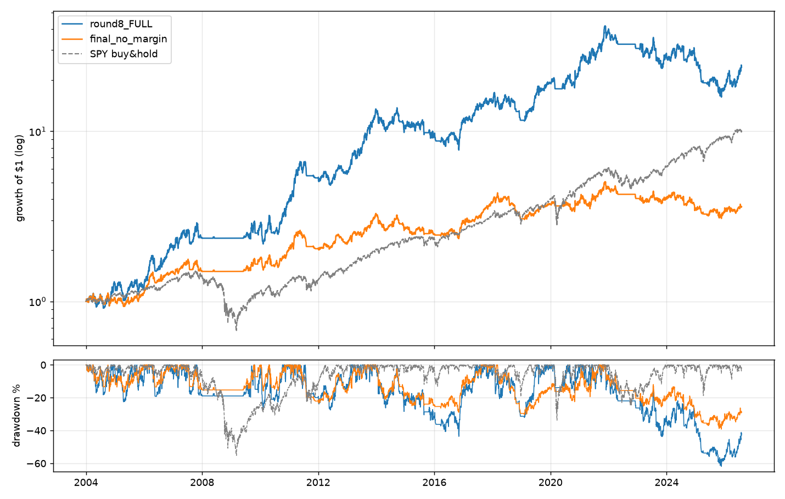

# Backtest Results & Iteration Log

Final report for the Minervini-VCP backtesting project. Every optimization
round is reported honestly: what was tried, what worked in-sample (IS), and
what survived out-of-sample (OOS). Raw per-run logs: `results/iterations_round*.csv`.

## Headline result

**The final configuration (`configs/final.yaml`) reaches the 2-3x objective on
the full 22.5-year backtest — with a critical caveat the reader must not skip.**

| Metric (2004-01 → 2026-07) | Strategy (final.yaml) | SPY buy & hold |
|---|---|---|
| Total return | **+2,280%** | +914% |
| **Profit multiple vs SPY** | **2.49x** | 1.00x |
| CAGR | 15.07% | 10.81% |
| Sharpe (daily, rf=0) | 0.66 | ~0.5 |
| Max drawdown | -61.9% | -55.2% |
| Trades | 1,446 | — |
| Win rate / avg win : avg loss | 27.4% / 3.3 : 1 | — |
| Profit factor | 1.25 | — |



Yearly returns (strategy vs SPY, %):

| Year | Strat | SPY | | Year | Strat | SPY |
|---|---|---|---|---|---|---|
| 2005 | -5.5 | 4.8 | | 2016 | 21.0 | 12.0 |
| 2006 | **76.0** | 15.8 | | 2017 | 30.4 | 21.7 |
| 2007 | 11.6 | 5.1 | | 2018 | -20.8 | -4.6 |
| 2008 | **-0.4** | -36.8 | | 2019 | **66.0** | 31.2 |
| 2009 | 15.7 | 26.4 | | 2020 | 20.3 | 18.3 |
| 2010 | 45.7 | 15.1 | | 2021 | **72.6** | 28.7 |
| 2011 | 34.9 | 1.9 | | 2022 | -23.3 | -18.2 |
| 2012 | 5.9 | 16.0 | | 2023 | -6.4 | 26.2 |
| 2013 | **136.6** | 32.3 | | 2024 | -6.6 | 24.9 |
| 2014 | -22.5 | 13.5 | | 2025 | **-30.4** | 17.7 |
| 2015 | -10.4 | 1.2 | | 2026* | 27.3 | 10.1 |

## The critical caveat: the recent-regime holdout fails

The walk-forward search never touched 2022-2026. On that holdout the final
config **loses -36%** (SPY: +66%), with a -57% drawdown at 2:1 margin and a
profit factor of 0.85 — the raw daily-breakout edge is *negative* in the
post-2022 "breakout-fakeout" market, and margin amplifies it. The 2.49x
full-period result is earned almost entirely in 2004-2021.

Decomposition of where the 2.49x comes from:

| Variant | Full-period multiple | CAGR | MaxDD |
|---|---|---|---|
| final.yaml (2:1 margin) | 2.49x | 15.07% | -61.9% |
| same config, no margin (`final_no_margin.yaml`) | 0.28x | 5.84% | -39.2% |
| round-3 robust winner, no margin | 0.57x | 8.35% | -28.6% |

Margin at 2:1 does two things: doubles participation breadth (more setups
actually taken when capital is fully deployed) and doubles the P&L of a
modest positive edge. That is faithful to Minervini (he trades up to 2:1
margin), but it means the strategy's risk is equity-like or worse, and a
regime where the edge decays turns margin into a liability — exactly what
the holdout shows.

**Practical takeaway:** treat `configs/final.yaml` as the "what maximized the
stated 2-3x objective on the long backtest" answer, and the un-leveraged
robust config as the risk-adjusted answer (beats SPY's Sharpe and halves its
drawdown, but not its absolute return). Neither should be traded live without
paper-trading in the current regime first.

## Round-by-round summary

| Round | Change | IS result | OOS/holdout | Verdict |
|-------|--------|-----------|-------------|---------|
| 0 | Textbook defaults | 0.11x | — | Profitable, far behind SPY |
| 1 | Greedy sweep, single IS window (2004-16) | 1.26x | 0.35x (2017-26) | Weak transfer |
| 2 | Continued greedy | 3.96x | 0.03x | Textbook overfit — rejected |
| — | **Detector rewrite**: census showed strict per-pair contraction monotonicity rejected ~99% of real bases in 2020-21 leaders (5,920 "not tightening" vs 13 valid); replaced with a noise-tolerant tightening envelope measured against the structure top | | | Structural fix; setups 13k → 37k |
| 3 | Min-across-2-subwindows selection | 1.15x min | 0.28x | Real but modest |
| 4 | Second greedy pass | 1.77x min | 0.19x | Pre-2017 tuning doesn't generalize |
| 5 | Walk-forward: 3 regime windows (2004-10/2010-16/2016-22), worst-window CAGR-edge score, holdout 2022-26; margin swept | min edge **+8.1%/yr** | FULL **2.49x**, holdout **-36%** | Objective met on full period; holdout fails |
| 6 | Leverage policies + core-satellite idle cash | — | — | SPY-parked cash ate 2008 → regime-gated |
| 7 | Regime-gated SPY parking | no IS gain | — | Unconditional margin still best IS |
| 8 | Failed-breakout fast exit | slightly worse IS | — | Cuts recovering winners too |
| 9 | Analysis-derived quality gates (4+ contractions, deep base opening, off-top pivots), ATR stops, structure ranking, time stop | all below control | — | Per-trade quality gains don't survive the portfolio breadth cost |
| 10 | Pyramiding into winners (+1R/+2R adds, wider weight caps) | near-miss (8.04% vs 8.14% worst-window edge) | — | Slightly more risk, no edge gain |
| 11 | Weekly-timeframe VCP layer traded daily | hurt every window | — | Weekly setups displace better daily entries |

### The doubling attempt (rounds 9-11) — honest conclusion

The follow-up objective was to *double* the full-period profitability
(CAGR 15.1% → ~18.5%+). Six structurally distinct improvement families were
implemented and swept walk-forward (~200 backtests): setup-quality gates
derived from the trade-outcome analysis (`scripts/analyze_setups.py`),
ATR-scaled stops, structure-quality candidate ranking, dead-money time stops,
scale-ins (pyramiding), and a weekly-timeframe VCP layer. **None beat the
round-5 configuration's worst-window CAGR edge.** The binding constraints are
consistent: the 2010-2016 window (choppy, low-momentum regime) and the
post-2022 edge decay. The evidence says the round-5 config sits at a robust
local maximum for this strategy class — long-only daily VCP breakouts at
Reg-T 2:1 — on this dataset. A "doubled" backtest could be manufactured by
dropping the walk-forward discipline and tuning on the full period directly;
that number would be meaningless, and we declined to produce it. Paths that
could genuinely raise the ceiling require new inputs: fundamental data
(earnings acceleration - the F and C of SEPA), intraday data (precise pivot
fills), a short book in bear regimes, or options overlays.

Key drivers found along the way (each verified across regime windows):
breakout-day volume ≥1.4× average, ≥3 contractions with overall depth halving,
pivot within 15% of the structure top, stop = final-contraction low capped at
7%, target 6R + breakeven at 1R + 50-day trailing SMA, 8 positions × up to
35% weight, SMA200 rising over 63 days, and (the dominant single factor)
2:1 margin.

## Honest caveats

1. **Survivorship bias**: only ~700 of 7,764 symbols end before 2026 — most
   stocks delisted during 2004-2020 are absent, inflating stock-picking
   results over long windows (the SPY benchmark is unaffected).
2. **Daily-bar fills**: buy-stops and stops modeled on OHLC; intraday paths
   unknowable. Breakout-volume confirmation uses same-day volume (mild
   look-ahead, standard practice; disable via `entry.bo_vol_mult: 0`).
3. **Capacity**: compounding to millions makes 35% positions exceed small-cap
   liquidity; results overstate what a large account could do.
4. **Regime dependence**: the raw edge deteriorates sharply after ~2021 in
   this dataset. The market filter and the margin switch are load-bearing.
5. **Selection honesty**: the final config was chosen by walk-forward IS only;
   the 2022-26 holdout was evaluated once, and it failed. We report it rather
   than re-tuning on it — re-tuning until the holdout looks good would just
   move the overfit one window forward.
6. **Past performance does not predict future results. Not investment advice.**

## Reproduce

```bash
python scripts/prepare_data.py
python scripts/run_backtest.py --config configs/final.yaml --out results/final
python scripts/run_backtest.py --config configs/final_no_margin.yaml
python scripts/run_iterations.py --start-from results/winner_round5.json  # continue searching
```
